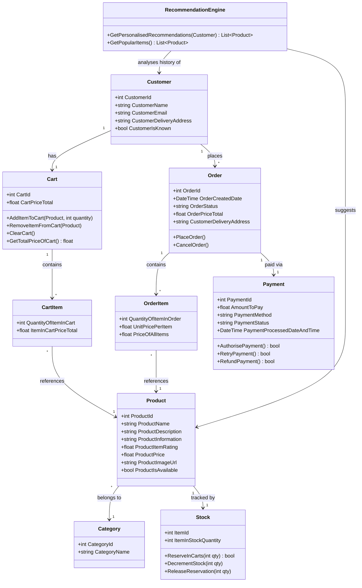

## Class Diagram for Nothing Store
### Source: Unit 3 Assessment

This diagram was still designed to fit the brief of user product search + placing an order.
However, at the time, for the assessment brief, I chose to omit user account functionality. This would be a feature that would be implemented in practice however.

#### Diagram

