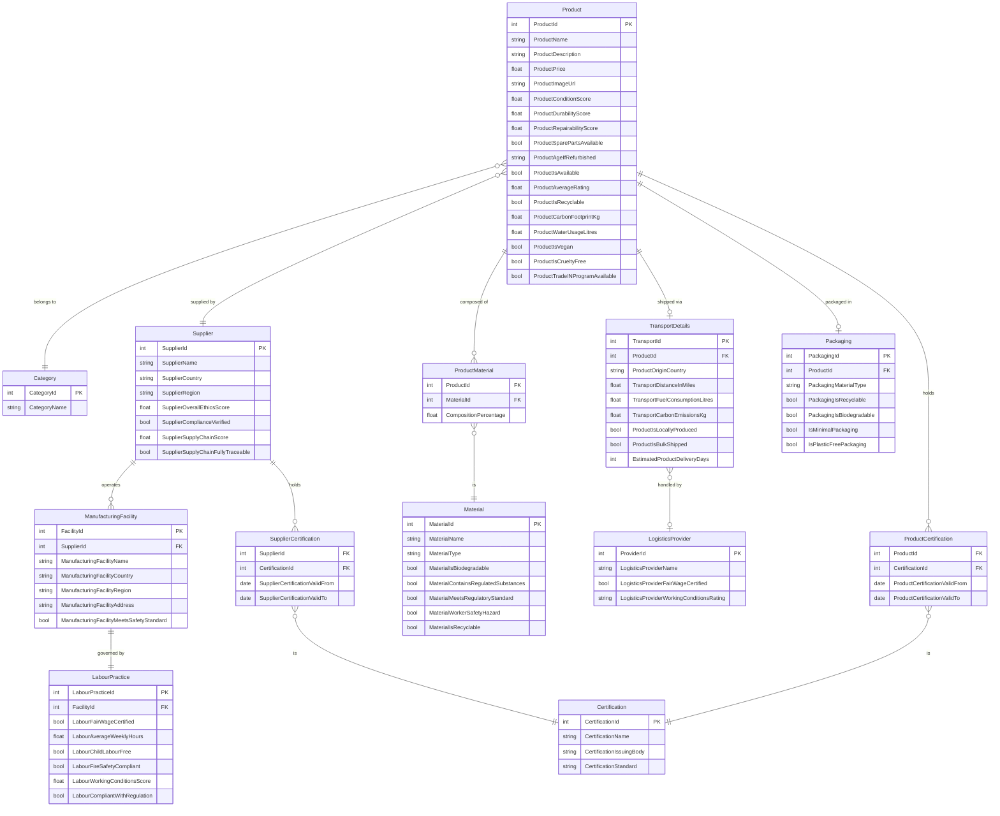

## Entity Relationship Diagram for Product Search + Order
### Source: Unit 3 Assessment

As the typical customer of the Nothing Store may be concerned about ethical purchasing decisions, some factors were considered about extra product information we may need to collect and verify to enable this:

##### Transport information:
- Is the item produced and shipped locally?
- How many air miles/fuel mileage does it take to deliver the item to the end customer? Are carbon emissions considered?
- Is the item shipped on it’s own, or in bulk orders? (Even if this means it takes longer to arrive, overall fuel consumption and emissions should be lowered).
- Is the packaging reasonable? Is it made of biodegradable materials, or can it be re-used for another purpose? (Seed pots etc).

##### Material information:
- Exact materials used (Plastic, metals, wood, etc).
- Composition of synthetic materials – Do they contain materials deemed unsafe by some standard? (e.g. EU regulations)
- Is the material safe for the end user, but a hazard to workers assembling the product?
- If animal products are involved, is this cruelty free? Is it vegan? (However – more recently people have argued products such as vegan leather are actually more harmful overall – as they are often plastic, not biodegradable, and are less durable than traditional alternatives.)
- Is animal testing involved?
- If animal fur, silk, wool etc is used, are the sourcing practices appropriate?
- Durability rating of materials, especially for items like clothing – long lasting clothing, furniture etc are more ethical to buy as they will last longer. This reduces overall landfill waste.
- Ease of repair, and availability of repair parts (especially for say, electronics).
- Is the item itself recyclable/biodegradable?

##### Labour practices information:
- Who is the product produced by?
- Where is the product produced? (Both as some regions will have better labour regulations, and because customers may be concerned with bringing profit to certain economies due to political affiliations).
- Are the people making the product paid a fair wage?
- Are they working under fair conditions?
o	What constitutes fair conditions – details like exact warehouse locations, fire safety, working hours, lack of child labour etc.
o	Can refer to existing regulations around this.
- Are the people handling packing, logistics and delivery being paid a fair wage, and working under fair conditions?

##### General item information:
- Age of the item
- Condition of the item
- Is it refurbished/vintage/second-hand? This could be a bonus for customers who are sustainability focused, even if the original labour practices cannot be traced.
- Rating of the stock provider/artisan/retailer.
- Item rating if not single instance item (e.g. Second-hand)
- Has the retailer/provider been proven to historically follow the sustainability and labour practices they promote?
- Are they accredited with any trustable certifying bodies? (Fairtrade, Rainforest Alliance, Forest Stewardship Council etc).
- How much fresh water is used in the making of the product?
- Is there a trade-in program available for the product at the end of it’s life, or can you trade in an old product of your own for the retailer to refurbish/recycle?

#### Diagram

