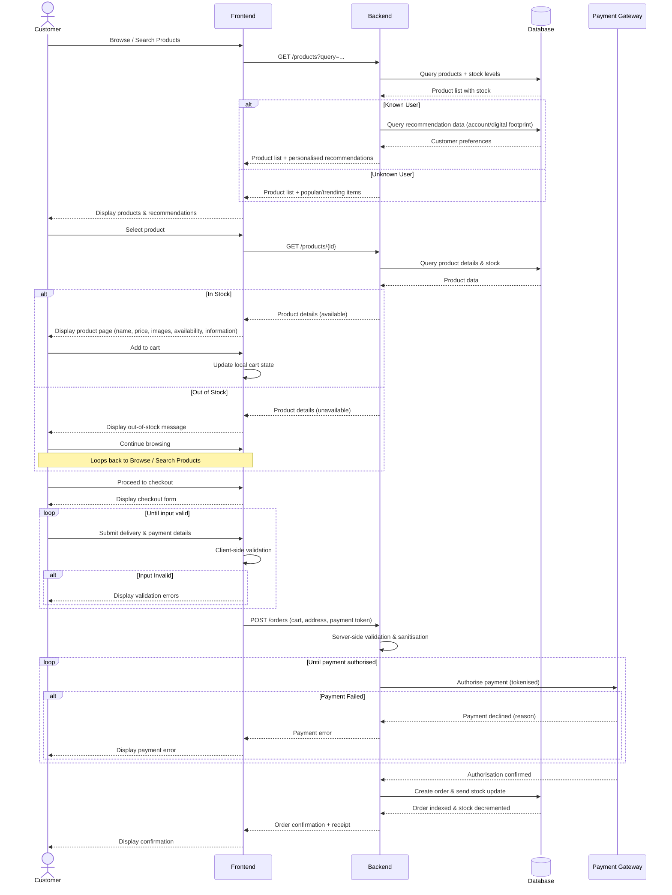

## Sequence Diagram for Product Search + Order
### Source: Unit 3 Assessment

This diagram similarly follows the user in finding a product and placing an order, but with more focus on the exact order of actions in terms of which part of the system talks to which.

#### Diagram

